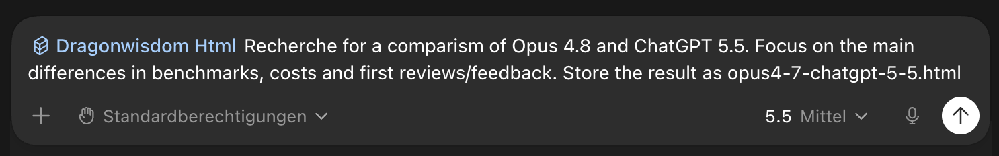
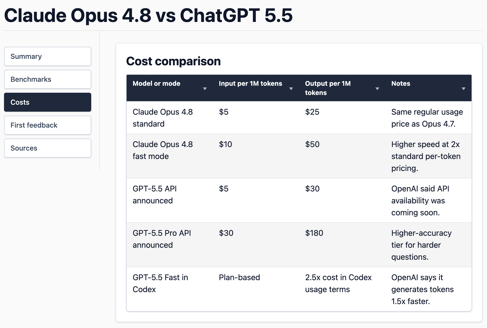
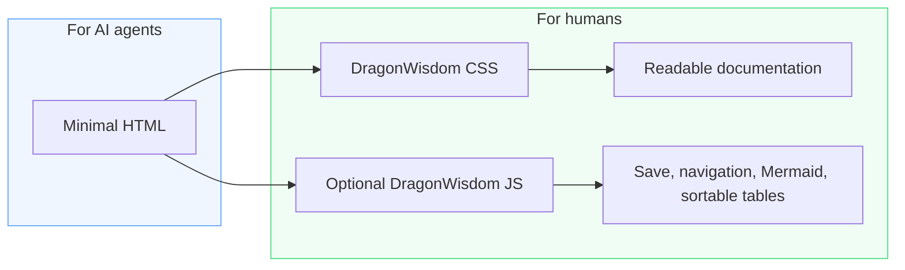
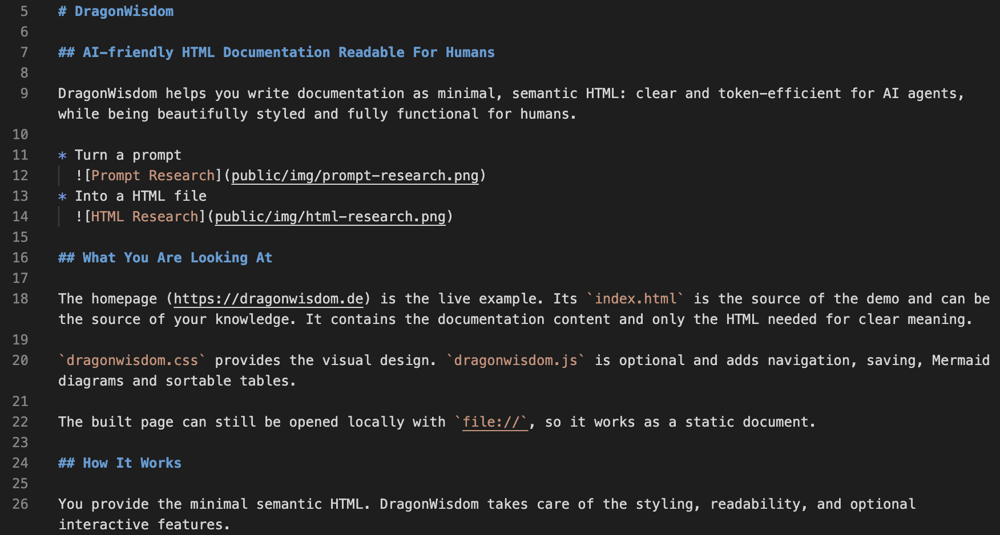
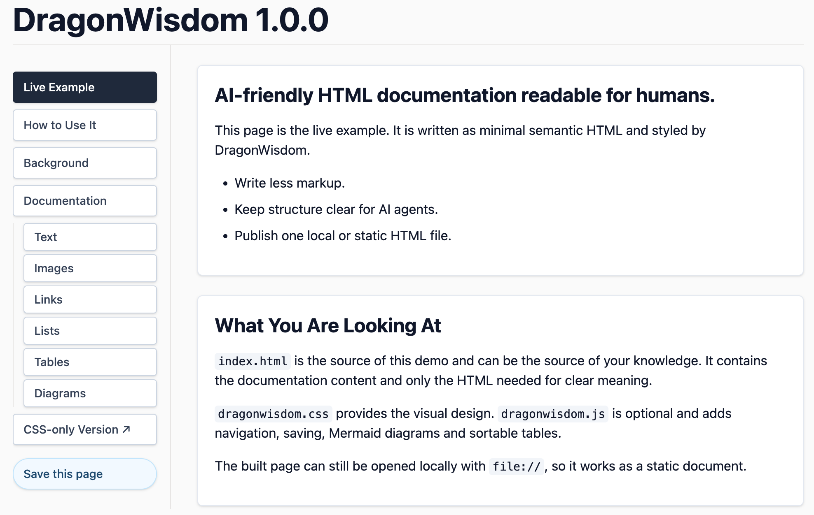

[](https://creativecommons.org/licenses/by/4.0/)

Homepage: https://dragonwisdom.de

# DragonWisdom

## AI-friendly HTML documentation readable for humans.

DragonWisdom helps you write documentation as minimal, semantic HTML: clear and token-efficient for AI agents, while being beautifully styled and fully functional for humans.

* Turn a prompt
  
* Into a HTML file
  

## What You Are Looking At

The homepage (https://dragonwisdom.de) is the live example. Its `index.html` is the source of the demo and can be the source of your knowledge. It contains the documentation content and only the HTML needed for clear meaning.

`dragonwisdom.css` provides the visual design. `dragonwisdom.js` is optional and adds navigation, saving, Mermaid diagrams and sortable tables.

The built page can still be opened locally with `file://`, so it works as a static document.

## How It Works



## How to Use It

### AI Skill

Install the DragonWisdom HTML skill for AI agents with one command. The installer replaces an existing skill at `$HOME/.agents/skills/dragonwisdom-html`.

```sh
curl -o- https://dragonwisdom.de/install-skill.sh | bash
```

```sh
wget -qO- https://dragonwisdom.de/install-skill.sh | bash
```

Use the skill by starting your prompt with `$dragonwisdom-html`.

### Use the Homepage as a Template

Visit the Homepage (https://dragonwisdom.de), Press Ctrl+S, or use the JavaScript Version's `Save this page` button. Then edit the saved HTML file for your own documentation.

#### Or Use Other Templates

* [Minimal template](https://dragonwisdom.de/minimal.html) for a simple page without navigation
  
* [Navigation template](https://dragonwisdom.de/nav.html) for a page with a main menu
  

### Alternative: Write Your Own HTML

You can create your own HTML documentation from scratch with the elements described in the documentation.

Add the CSS to your HTML:

```html
<link rel="stylesheet" href="https://releases.dragonwisdom.de/{version}/dragonwisdom.css">
```

Add the optional JavaScript when you want interactive navigation, saving, Mermaid rendering or sortable tables:

```html
<script src="https://releases.dragonwisdom.de/{version}/dragonwisdom.js"></script>
```

## Why HTML Instead of Markdown?

Anthropic proposed moving away from Markdown files toward HTML files in order to provide more structured information in repositories.

Compare the two variants yourself:

* Long/many **Markdown** files
  
* One structured **HTML** file
  

HTML can be useful for documentation, but it must stay small and easy to write.

### What HTML Adds

* Semantic HTML improves how AI agents understand and process information.
* More information can be presented in a visually structured, human-friendly way.
* HTML enables features such as Mermaid diagrams, sortable tables and saveable pages.

### What DragonWisdom Avoids

* Verbose utility classes in every HTML element.
* JavaScript as a hard requirement.
* Layout wrappers that do not add meaning.

#### TailwindCSS:

```html
<section class="mx-auto max-w-5xl rounded-md border border-slate-200 bg-white p-5 shadow-sm">
  <h2 class="mb-3 mt-0 text-2xl font-bold leading-tight text-slate-900">AI-friendly HTML documentation readable for humans</h2>
  <p class="my-4 text-base leading-6 text-slate-900">DragonWisdom helps you write documentation as minimal, semantic HTML: clear and token-efficient for AI agents, while being beautifully styled and fully functional for humans.</p>
  <div class="grid grid-cols-1 gap-4 md:grid-cols-2">
    <p class="my-4 min-w-0 text-base leading-6 text-slate-900">Turn a prompt </p>
    <p class="my-4 min-w-0 text-base leading-6 text-slate-900">Into a HTML file </p>
  </div>
</section>
```

#### DragonWisdom:

```html
<section>
  <h2>AI-friendly HTML documentation readable for humans</h2>
  <p>DragonWisdom helps you write documentation as minimal, semantic HTML: clear and token-efficient for AI agents, while being beautifully styled and fully functional for humans.</p>
  <div class="split-2">
    <p>Turn a prompt </p>
    <p>Into a HTML file </p>
  </div>
</section>
```

## The Solution

DragonWisdom keeps the source close to plain semantic HTML and moves the design into one CSS file.

* Use regular elements such as headings, paragraphs, lists, tables and figures.
* Add classes only when they change meaning or enable a feature.
* Use JavaScript only for opt-in behavior.

## Build Locally

1. Clone the repository.
2. Install dependencies via `npm i`.
3. Start the server via `npm run dev` and open the page in the browser.
4. Build the static artifacts via `npm run build`, they will be available in `dist/public`.

## Questions and/or Feedback?

Made with [DragonWisdom](https://dragonwisdom.de) by [Sharaal](https://sharaal.de), [CC BY 4.0](https://creativecommons.org/licenses/by/4.0/), [Support me](https://buymeacoffee.com/sharaal)
